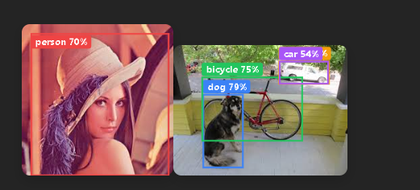
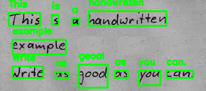
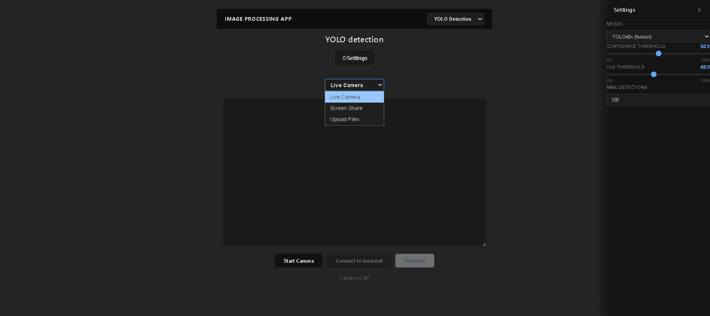
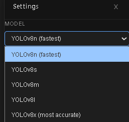
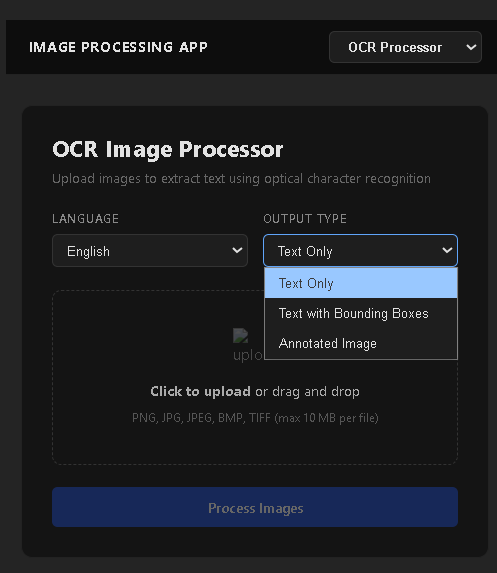

# full-stack-computer-vision
Real-time object detection (YOLOv8) + OCR (Tesseract) full-stack app with FastAPI backend and React frontend.

<table align="center">
  <tr>
    <td align="center">
      
    </td>
    <td align="center">
      
    </td>
  </tr>
</table>

<p align="center">
  Object detection (left) — Text extraction with boxes (right)
</p>

## Features
✦ Provides a full-stack solution for real-time object detection, including a web-based UI with dynamic settings.
</img>
*Browser interface: select model, adjust confidence/IOU, see real-time bounding boxes*

✦ Integrates configurable YOLOv8 models (nano, small, medium, large, extra-large) for efficient AI-powered inference on the backend.
<p align="center">
</img>
</p>
*Switch models on-the-fly without restarting*

✦ Offers an HTTP `/health` endpoint for quick server status checks, including a list of currently loaded models, and a `/models` endpoint to list available YOLO models.
✦ Processes base64-encoded image frames received over WebSocket from various sources.
✦ Allows dynamic adjustment of detection parameters (model, confidence threshold, IOU threshold, max detections) via WebSocket.
✦ Returns structured JSON detection results including normalized bounding box coordinates, labels, and confidence.

✦ Supports multiple video input sources from the frontend: live camera feed, desktop screen sharing, and local file uploads (images/videos).

✦ Visualizes object detection results (bounding boxes, labels, confidence) directly on the video stream in real-time.

✦ Includes OCR (Optical Character Recognition) capabilities for extracting text from images, providing plain text, text with bounding box information, or an annotated image.
<p align="center">
</img>
</p>

## Usage
### Installation (Backend)
First, ensure you have Python 3.8+ installed. Then, install the required dependencies:

```bash
pip install fastapi uvicorn "ultralytics[yolo]" Pillow pydantic pydantic-settings pytesseract opencv-python
```
For OCR functionality, you must also install the Tesseract OCR engine on your system. Refer to the official [Tesseract documentation](https://tesseract-ocr.github.io/tessdoc/Installation.html) for installation instructions specific to your operating system.
The backend server automatically downloads and caches required YOLOv8 models (e.g., `yolov8n.pt`), with the default and available models configured in `app/core/config.py`.

### Installation (Frontend)
Navigate to the `frontend/` directory and install the Node.js dependencies:

```bash
cd frontend
npm install
# or yarn install
```

### Running the Server (Backend)
Start the FastAPI server:

```bash
python app/main.py
```
Server configuration, including default detection parameters and available models, can be customized using environment variables or a `.env` file (e.g., `DEFAULT_MODEL=yolov8m`). OCR settings like `TESSERACT_PATH` (path to Tesseract executable) and `DEFAULT_OCR_LANGUAGE` can also be configured.
The server will start on `http://localhost:8000`.

### Running the Client (Frontend)
In a separate terminal, navigate to the `frontend/` directory and start the development server:

```bash
cd frontend
npm run dev
# or yarn dev
```
The client application will typically open in your browser at `http://localhost:5173`. Ensure both backend and frontend are running for full functionality. The client application offers two main sections: real-time YOLO detection and an OCR image processor, accessible via the navigation bar.

### WebSocket API (Backend)
The frontend client automatically connects to the WebSocket endpoint at `ws://localhost:8000/ws`.

**Sending Data:**
The client sends JSON messages over the WebSocket connection. There are two types of messages:

1.  **Image Frames:** To send an image for detection:
    ```json
    {
      "image": "base64_encoded_image_string_here..."
    }
    ```
    *Note: The `confidence_threshold` is now managed via a separate settings message, not per-frame.*

2.  **Settings Updates:** To dynamically adjust detection parameters (model, confidence threshold, IOU threshold, maximum detections):
    ```json
    {
      "type": "settings",
      "model": "yolov8m",              // e.g., yolov8n, yolov8s, yolov8m, yolov8l, yolov8x
      "confidence": 0.5,               // float from 0.0 to 1.0
      "iou": 0.45,                     // float from 0.0 to 1.0
      "maxDetections": 100             // integer
    }
    ```
    Only the parameters present in the `settings` message will be updated.

**Receiving Data:**
The server will respond with JSON messages containing detection results for each processed frame. Each message will have a `"detections"` key containing a list of objects, structured as follows:

```json
{
  "detections": [
    {
      "label": "person",
      "confidence": 0.897,
      "x1": 0.1234,
      "y1": 0.5678,
      "x2": 0.3456,
      "y2": 0.7890
    },
    // ... more detection objects
  ]
}
```
Coordinates (`x1`, `y1`, `x2`, `y2`) are normalized (0.0 to 1.0) relative to the image dimensions.

### OCR API (Backend)
The backend provides REST API endpoints for Optical Character Recognition. All endpoints accept image files (`.png`, `.jpeg`, `.jpg`, `.bmp`, `.tiff`) up to 10 MB and support a `language` query parameter (e.g., `eng`, `spa`).

1.  **Extract Plain Text:** `POST /ocr/extract`
    *   **Description:** Extracts all discernible text from an uploaded image.
    *   **Input:** `multipart/form-data` with an `UploadFile` (image) and an optional `language` query parameter.
    *   **Output:** `application/json`
        ```json
        {
          "job_id": "...",
          "text": "Extracted text content...",
          "confidence": 85.3, // average confidence
          "language": "eng",
          "processed_at": "2026-03-04T18:12:00Z"
        }
        ```

2.  **Extract Text with Bounding Boxes:** `POST /ocr/extract-with-boxes`
    *   **Description:** Extracts text and provides detailed bounding box coordinates for each detected word.
    *   **Input:** `multipart/form-data` with an `UploadFile` (image) and an optional `language` query parameter.
    *   **Output:** `application/json`
        ```json
        {
          "job_id": "...",
          "text": "Extracted text content...",
          "words": [
            {
              "text": "Word",
              "confidence": 98.5,
              "bounding_box": { "left": 10, "top": 20, "width": 50, "height": 15 }
            },
            // ... more words
          ],
          "total_words": 123,
          "language": "eng",
          "processed_at": "2026-03-04T18:12:00Z"
        }
        ```

3.  **Extract Annotated Image:** `POST /ocr/extract-annotated`
    *   **Description:** Returns the uploaded image with bounding boxes drawn around the detected text.
    *   **Input:** `multipart/form-data` with an `UploadFile` (image) and an optional `language` query parameter.
    *   **Output:** `image/png` (binary image data) with `X-Total-Words` header.